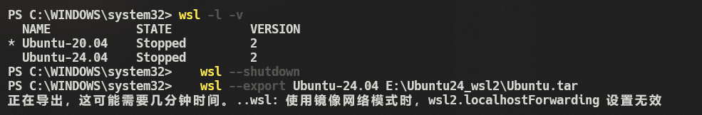
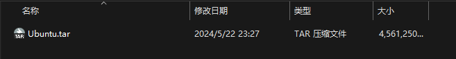
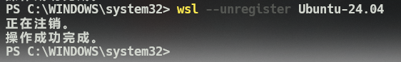
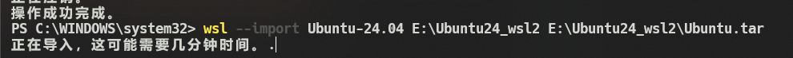

# WIN11下常用

## win11新机开发环境配置

1. 卸载无用的软件
2. 切换暗黑系主题
3. 鼠标调整黑色最大
4. 输入法设置
5. 科学上网设置，abpubs.xyz，安装v2Ray
6. 谷歌浏览器下载和同步
7. 启用win子系统
8. 下载ubuntu
   1. 下载安装wsl2更新包，<https://learn.microsoft.com/en-us/windows/wsl/install-manual#step-4---download-the-linux-kernel-update-package>
   2. 然后在powershell中输入命令：wsl --update，完成更新；
9. 安装docker, <https://docs.docker.com/engine/install/ubuntu/#install-using-the-repository>

   ``` yaml  
      # Add Docker's official GPG key:
      sudo apt-get update
      sudo apt-get install ca-certificates curl
      sudo install -m 0755 -d /etc/apt/keyrings
      sudo curl -fsSL https://download.docker.com/linux/ubuntu/gpg -o /etc/apt/keyrings/docker.asc
      sudo chmod a+r /etc/apt/keyrings/docker.asc

      # Add the repository to Apt sources:
      echo \
        "deb [arch=$(dpkg --print-architecture) signed-by=/etc/apt/keyrings/docker.asc] https://download.docker.com/linux/ubuntu \
        $(. /etc/os-release && echo "$VERSION_CODENAME") stable" | \
        sudo tee /etc/apt/sources.list.d/docker.list > /dev/null
      sudo apt-get update
      # install docker
      sudo apt-get install docker-ce docker-ce-cli containerd.io docker-buildx-plugin docker-compose-plugin

      # 建立用户组
      sudo groupadd docker
      sudo usermod -aG docker $USER
      sudo gpasswd -a $USER docker

      # 启用docker服务
      sudo systemctl enable docker.service
      sudo systemctl enable containerd.service

      # 测试 (可能需要重启wsl2)
      docker run --rm hello-world
   ```

10. 安装nvidia-docker2, <https://docs.nvidia.com/datacenter/cloud-native/container-toolkit/latest/install-guide.html>

   ``` yaml
      # 添加仓库
      curl -fsSL https://nvidia.github.io/libnvidia-container/gpgkey | sudo gpg --dearmor -o /usr/share/keyrings/nvidia-container-toolkit-keyring.gpg \
      && curl -s -L https://nvidia.github.io/libnvidia-container/stable/deb/nvidia-container-toolkit.list | \
      sed 's#deb https://#deb [signed-by=/usr/share/keyrings/nvidia-container-toolkit-keyring.gpg] https://#g' | \
      sudo tee /etc/apt/sources.list.d/nvidia-container-toolkit.list

      sudo apt-get update
      sudo apt-get install -y nvidia-container-toolkit nvidia-docker2

      # config
      sudo nvidia-ctk runtime configure --runtime=docker
      sudo systemctl restart docker
   ```

11. 配置终端zsh

    - 获取zsh并配置zsh为shell

      ``` yaml
         sudo apt install curl zsh git
         # 国内网络优先使用github镜像源安装
         sh -c "$(curl -fsSL https://raw.kkgithub.com/ohmyzsh/ohmyzsh/master/tools/install.sh)"

         # 如果github连接没问题可以尝试下面的命令
         sh -c "$(curl -fsSL  https://raw.github.com/ohmyzsh/ohmyzsh/master/tools/install.sh)"
      ```  

    - 安装插件

      ``` yaml
         git clone https://gitee.com/haohaogood/zsh-autosuggestions.git ~/.oh-my-zsh/custom/plugins/zsh-autosuggestions
         git clone https://gitee.com/haohaogood/zsh-syntax-highlighting.git ~/.oh-my-zsh/custom/plugins/zsh-syntax-highlighting
         git clone https://gitee.com/wangl-cc/zsh-history-substring-search.git ${ZSH_CUSTOM:-~/.oh-my-zsh/custom}/plugins/zsh-history-substring-search
         git clone --depth=1 https://gitee.com/romkatv/powerlevel10k.git ${ZSH_CUSTOM:-$HOME/.oh-my-zsh/custom}/themes/powerlevel10k
         # p10k configure 可重新配置p10k
         source ~/.zshrc

      ```

    - 修改~/.zshrc文件

      ``` yaml
         cd ~
         # 下面这个命令是更换zsh主题, 目前我默认的主题时ys，
         sed -i 's/^ZSH_THEME=".*"$/ZSH_THEME="powerlevel10k\/powerlevel10k"/' ~/.zshrc
         echo 'plugins=(
          z
          zsh-history-substring-search
          git
          docker
          zsh-autosuggestions
          zsh-syntax-highlighting
         )
         source $ZSH/oh-my-zsh.sh
         ' | sudo tee -a ~/.zshrc
         
      ```

## WSL2迁移到其他盘

1. 在power shell中查看wsl名称和版本

   ``` yaml  
   # 查看版本
   wsl -l -v

   # 关闭wsl
   wsl --shutdown

   ```

2. 导出备份，导出备份到指定文件夹，命令格式为 wsl --export <虚拟机名称> <导出路径>。

   ``` yaml  
   wsl --export Ubuntu-24.04 E:\Ubuntu24_wsl2\Ubuntu.tar
   ```

   

   

3. 注销要迁移的系统, 在终端中输入

   ``` yaml
   wsl --unregister Ubuntu-24.04
   ```

   

4. 将备份文件恢复到指定目录,恢复备份到指定目录，命令格式为 wsl --import <虚拟机名称> <恢复路径> <备份路径>。

   ``` yaml
   wsl --import Ubuntu-24.04 E:\Ubuntu24_wsl2 E:\Ubuntu24_wsl2\Ubuntu.tar

   ```

   

5. 最重要！在终端中，输入 Linux发行版名称 config --default-user 原本用户名

   ``` yaml
   Ubuntu2404 config --default-user  wq
   ```

